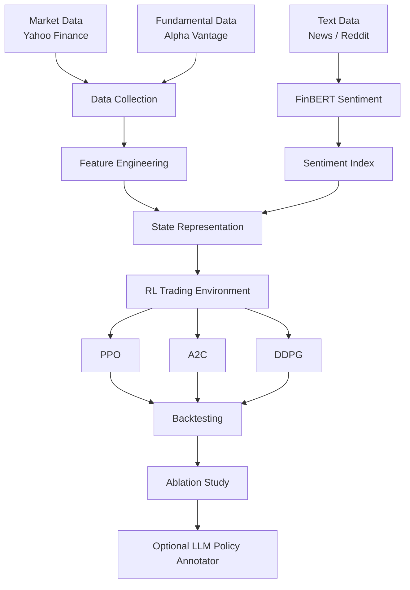

## Agentic Financial Trading with Reinforcement Learning and Sentiment Analysis

A research project that explores how financial sentiment analysis and reinforcement learning (RL) can be combined to support automated trading decisions under controlled offline backtesting conditions.

This project was developed as part of a Master’s thesis in Data Science and focuses on designing a modular AI trading framework that integrates:

- financial market data

- fundamental indicators

- sentiment signals

- reinforcement learning agents

- an optional LLM-based policy oversight layer

The system evaluates trading strategies using offline historical data only and emphasizes risk-aware portfolio metrics rather than profit claims.

---

## Project Overview

The goal of this project is to study how different sources of financial information can improve trading decisions when used as inputs to reinforcement learning agents.

The system combines three types of financial signals:

- Market data

- Fundamental company indicators

- Financial sentiment signals

These signals form the state representation for reinforcement learning agents, which learn trading strategies through a custom portfolio simulation environment.

---

## Project Highlights

• Designed an end-to-end **AI trading research pipeline** integrating financial data, sentiment analysis, and reinforcement learning.

• Developed a **custom multi-asset reinforcement learning trading environment** using OpenAI Gym to simulate portfolio allocation and transaction costs.

• Integrated **FinBERT financial sentiment analysis** to convert textual information into quantitative signals for reinforcement learning agents.

• Implemented and evaluated multiple reinforcement learning algorithms (**PPO, A2C, DDPG**) for portfolio decision making.

• Conducted **feature ablation studies** to analyze the impact of technical, fundamental, and sentiment features on trading performance.

• Proposed an **optional LLM policy oversight layer** to review agent decisions and explore agentic AI governance concepts.

• Built a **fully modular and reproducible research pipeline** covering data collection, feature engineering, model training, evaluation, and experimentation.

---

## System Architecture

