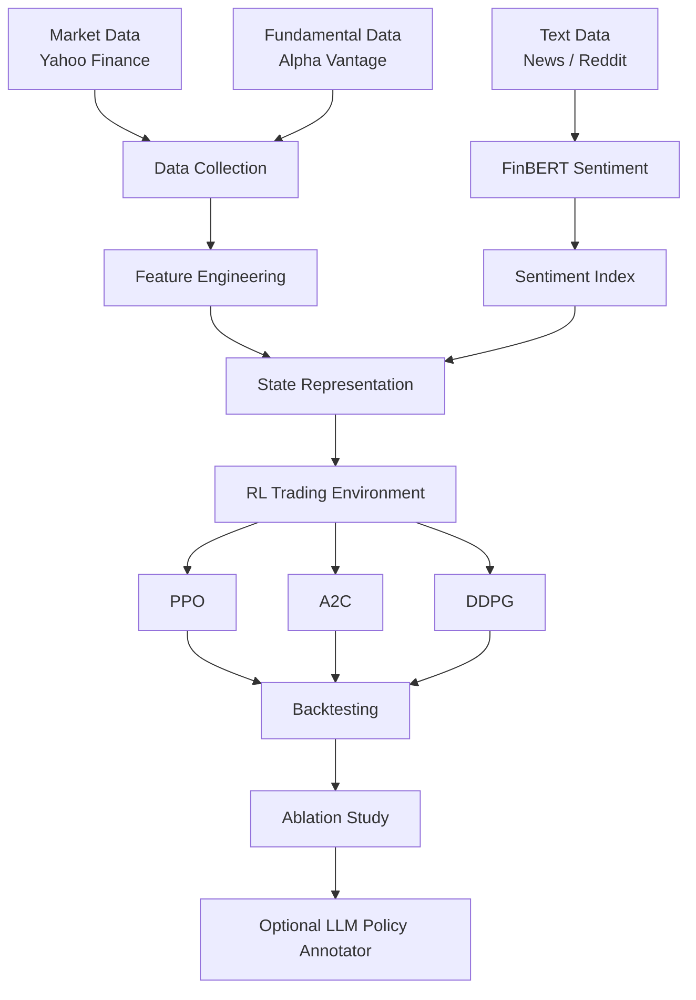

## Agentic Financial Trading with Reinforcement Learning and Sentiment Analysis

A research project that explores how financial sentiment analysis and reinforcement learning (RL) can be combined to support automated trading decisions under controlled offline backtesting conditions.

This project was developed as part of a Master’s thesis in Data Science and focuses on designing a modular AI trading framework that integrates:

- financial market data

- fundamental indicators

- sentiment signals

- reinforcement learning agents

- an optional LLM-based policy oversight layer

The system evaluates trading strategies using offline historical data only and emphasizes risk-aware portfolio metrics rather than profit claims.

---

## Project Overview

The goal of this project is to study how different sources of financial information can improve trading decisions when used as inputs to reinforcement learning agents.

The system combines three types of financial signals:

- Market data

- Fundamental company indicators

- Financial sentiment signals

These signals form the state representation for reinforcement learning agents, which learn trading strategies through a custom portfolio simulation environment.

---

## Project Highlights

• Designed an end-to-end **AI trading research pipeline** integrating financial data, sentiment analysis, and reinforcement learning.

• Developed a **custom multi-asset reinforcement learning trading environment** using OpenAI Gym to simulate portfolio allocation and transaction costs.

• Integrated **FinBERT financial sentiment analysis** to convert textual information into quantitative signals for reinforcement learning agents.

• Implemented and evaluated multiple reinforcement learning algorithms (**PPO, A2C, DDPG**) for portfolio decision making.

• Conducted **feature ablation studies** to analyze the impact of technical, fundamental, and sentiment features on trading performance.

• Proposed an **optional LLM policy oversight layer** to review agent decisions and explore agentic AI governance concepts.

• Built a **fully modular and reproducible research pipeline** covering data collection, feature engineering, model training, evaluation, and experimentation.

---

## System Architecture

---

## System Workflow

The full pipeline executes in the following stages:
1. Collect financial market data
2. Engineer financial features
3. Generate sentiment signals using FinBERT
4. Build RL-ready datasets
5. Train reinforcement learning agents
6. Evaluate strategies using offline backtesting
7. Perform ablation studies
8. Optionally apply LLM policy moderation

---

## Data Sources

The project integrates multiple financial data sources.

- Market Data

- Historical stock market data including:

- Open

- High

- Low

- Close

- Adjusted Close

- Volume

Collected using the Yahoo Finance API.

---

## Fundamental Indicators

Company financial metrics used to capture business fundamentals.

Examples include:

- earnings per share

- revenue

- net income

- financial ratios

Collected using the Alpha Vantage API.

---
## Sentiment Signals

Financial sentiment signals are extracted from textual sources.

The project uses FinBERT, a transformer model trained specifically for financial language.

Sentiment outputs are converted into numerical signals and aggregated into a daily sentiment index.

---

## Feature Engineering

The system generates multiple feature groups used by the reinforcement learning agents.

Technical Indicators

Examples:

- RSI

- MACD

- CCI

- ADX

- price percentage changes

- trading volume

These indicators capture market momentum and price trends.

---

## Fundamental Ratios

Examples:

- Return on Equity (ROE)

- Return on Assets (ROA)

- Net Profit Margin

- Debt to Equity ratio

- Free Cash Flow

These represent company financial health.

---

## Sentiment Features

Examples:

- FinBERT sentiment scores

- aggregated daily sentiment index

- external sentiment indicators

These represent market perception and investor mood.

---

## Reinforcement Learning Environment

A custom OpenAI Gym environment was developed to simulate a multi-asset trading system.

Key characteristics:

- multi-asset portfolio

- continuous action space

- transaction costs

- portfolio value tracking

- risk-aware reward function

The environment receives actions from RL agents and updates portfolio positions accordingly.

---

## Reward Design

The reward function balances profitability and risk control.
Reward = portfolio_return − (drawdown_penalty × drawdown)
This discourages strategies that generate profits by taking excessive risk.

---

## Reinforcement Learning Agents

Three RL algorithms were evaluated:

** PPO — Proximal Policy Optimization

A stable policy gradient method commonly used in financial RL research.

** A2C — Advantage Actor Critic

An actor-critic algorithm that learns both policy and value functions.

** DDPG — Deep Deterministic Policy Gradient

A continuous control algorithm suitable for portfolio allocation problems.

